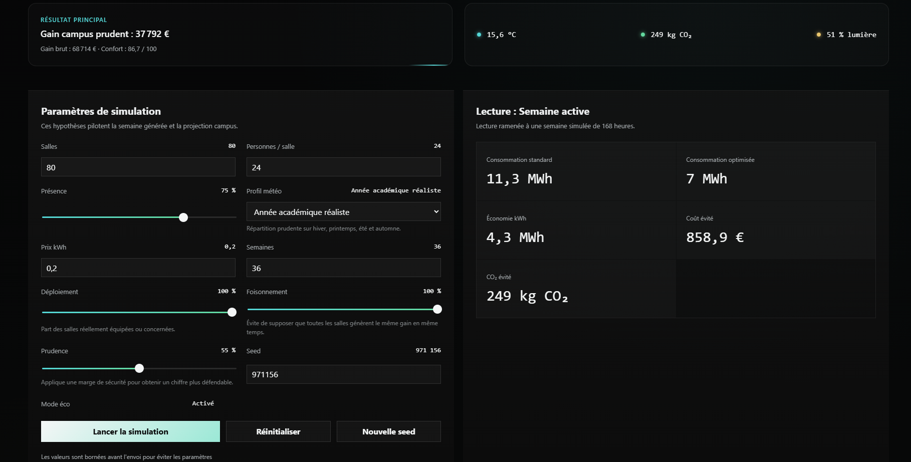
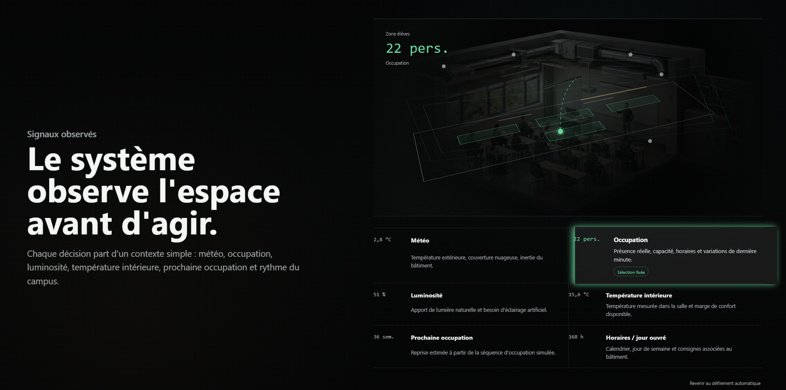
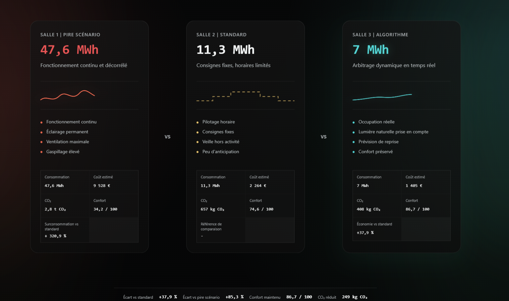

# Optimize Energy Campus

**Optimize Energy Campus** est une plateforme de simulation énergétique développée dans le cadre du module **Projet d’Étude et d’Exploration** en **ING2 à l’ECE**.

Le projet répond à une problématique centrale :

> **Comment repenser le dimensionnement énergétique d’un espace collectif, comme un campus ou un quartier, afin d’adapter la consommation aux usages réels ?**

L’idée du projet est de montrer qu’un espace de vie ne devrait pas consommer de l’énergie de manière uniforme. Une salle vide, lumineuse ou peu utilisée ne devrait pas être pilotée comme une salle pleine, sombre ou nécessitant davantage de chauffage, de climatisation ou de ventilation.

Avec mon équipe, nous avons donc imaginé une solution fondée sur des **capteurs** et un **algorithme de décision énergétique**. Le rôle de cette solution est d’observer l’état d’un espace, puis d’ajuster les principaux postes de consommation en fonction du contexte réel.

Cette plateforme constitue une **preuve de concept logicielle**. Elle ne pilote pas un bâtiment réel, mais elle permet de démontrer, à travers une simulation interactive, le fonctionnement et l’intérêt de l’approche proposée.

---

## Aperçu de l’interface

### Dashboard interactif

Le dashboard permet de modifier les hypothèses de simulation, de lancer le moteur Python, puis d’analyser les résultats principaux : gain campus prudent, économies en kWh, économies en euros, CO₂ évité et score de confort.



### Observation des signaux

La plateforme illustre l’idée d’un système capable d’observer l’espace avant d’agir : occupation, météo, luminosité, température intérieure, horaires et activité simulée.



### Comparaison des trois stratégies

La simulation compare trois modes de gestion énergétique appliqués au même contexte : un scénario défavorable, un fonctionnement standard et un algorithme optimisé.



---

## Contexte du projet

Dans un campus, toutes les salles ne sont pas utilisées de la même manière. Certaines sont occupées toute la journée, d’autres seulement quelques heures. Certaines bénéficient d’une bonne lumière naturelle, tandis que d’autres nécessitent davantage d’éclairage. De la même manière, les besoins en chauffage, climatisation et ventilation varient selon la météo, l’heure, la saison et le taux de présence.

Pourtant, dans de nombreux bâtiments, la consommation énergétique reste souvent pilotée de manière globale, avec des consignes fixes ou peu différenciées. Cela peut conduire à plusieurs formes de gaspillage :

- chauffer ou climatiser une salle vide ;
- éclairer un espace déjà suffisamment lumineux ;
- ventiler sans tenir compte de l’occupation réelle ;
- appliquer les mêmes consignes à des salles ayant des usages très différents ;
- dimensionner l’énergie selon des hypothèses trop générales.

Le projet part donc d’une idée simple :

> **L’énergie doit être adaptée à l’usage réel de l’espace.**

Optimize Energy Campus rend cette idée visible à travers une plateforme web de simulation.

---

## Objectif de la plateforme

La plateforme a été créée pour démontrer comment un algorithme pourrait aider à optimiser la gestion énergétique d’un espace collectif.

Elle permet de simuler un campus, de modifier les hypothèses principales, puis de comparer plusieurs stratégies de pilotage énergétique.

L’objectif est d’évaluer l’impact de ces stratégies sur :

- la consommation énergétique ;
- le coût estimé ;
- les émissions de CO₂ ;
- le confort des utilisateurs ;
- les économies potentielles à l’échelle d’un campus.

Le but n’est pas de produire une mesure réelle certifiée, mais de construire un **outil de démonstration**, capable d’expliquer et de visualiser l’intérêt d’un pilotage énergétique plus intelligent.

---

## Principe général de la solution

La solution imaginée repose sur deux briques principales :

1. **Des capteurs simulés**, qui permettent d’observer l’état d’un espace.
2. **Un algorithme de décision**, qui adapte la consommation selon les conditions observées.

Dans le proof of concept, les capteurs sont simulés à travers plusieurs variables :

- température extérieure ;
- température intérieure ;
- occupation de la salle ;
- luminosité naturelle ;
- horaires d’activité ;
- saison ;
- profil météo ;
- niveau de présence ;
- mode de fonctionnement énergétique.

À partir de ces signaux, l’algorithme agit sur les principaux postes de consommation :

- CVC : chauffage, ventilation, climatisation ;
- éclairage ;
- ventilation ;
- équipements électriques.

L’objectif est de réduire les consommations inutiles tout en conservant un niveau de confort acceptable.

---

## Fonctionnement de la simulation

Le moteur de simulation génère une semaine complète de fonctionnement, soit :

```text
168 heures simulées
```

Pour chaque heure, la simulation prend en compte :

- la température extérieure ;
- l’occupation ;
- la luminosité ;
- les horaires d’activité ;
- les besoins énergétiques ;
- les décisions de gestion énergétique ;
- le confort obtenu.

La simulation est contrôlée par une **graine aléatoire**. Cela permet de générer différents scénarios tout en gardant une simulation reproductible : avec la même graine et les mêmes paramètres, les résultats restent identiques.

Les résultats horaires sont ensuite agrégés, puis annualisés sur une base de :

```text
4 saisons × 13 semaines
```

Cette méthode permet de partir d’une simulation courte et lisible, puis de projeter les résultats à l’échelle d’une année.

---

## Les trois stratégies comparées

La plateforme compare trois modes de gestion appliqués au même contexte simulé.

### Salle 1 — Scénario défavorable

La première salle représente un fonctionnement volontairement défavorable.  
Elle illustre une situation dans laquelle la gestion énergétique est peu adaptée aux usages réels.

Ce scénario permet de visualiser une consommation élevée : fonctionnement continu, éclairage permanent, ventilation maximale ou manque d’adaptation aux conditions réelles.

Cette salle sert principalement de repère pour montrer ce qu’un mauvais pilotage peut produire.

### Salle 2 — Fonctionnement standard

La deuxième salle représente une gestion classique.  
Elle sert de **référence principale** pour mesurer l’intérêt de l’algorithme optimisé.

Elle correspond à un fonctionnement plus réaliste que le scénario défavorable, mais qui reste limité : les consignes sont plus fixes, l’anticipation est faible, et le système ne réagit pas finement à l’ensemble des signaux simulés.

### Salle 3 — Algorithme optimisé

La troisième salle représente la solution proposée.  
L’algorithme ajuste les décisions énergétiques en fonction des signaux simulés : occupation, météo, luminosité, température et horaires.

Le gain officiel est calculé entre la salle standard et la salle optimisée :

```text
Gain = Salle 2 standard - Salle 3 optimisée
```

Cette comparaison permet d’isoler l’effet de l’algorithme par rapport à une gestion classique.

---

## Projection à l’échelle d’un campus

Une erreur fréquente serait de multiplier directement le gain d’une salle par le nombre total de salles du campus.

Cette approche serait trop optimiste, car toutes les salles ne sont pas utilisées de la même manière, toutes ne sont pas déployées en même temps, et les gains réels peuvent varier selon les usages.

Pour éviter cela, la plateforme applique une projection plus prudente.

La logique utilisée est la suivante :

```text
Salles déployées = nombre de salles × taux de déploiement

Gain brut = gain par salle × salles déployées

Gain après foisonnement = gain brut × facteur de foisonnement

Gain prudent = gain après foisonnement × coefficient de prudence
```

Le **gain campus prudent** est donc l’indicateur principal mis en avant dans le dashboard.

---

## Facteur de foisonnement

Le facteur de foisonnement permet d’éviter de supposer que toutes les salles génèrent le même gain au même moment.

Dans un campus réel, les usages sont répartis : certaines salles sont très occupées, d’autres moins. Les horaires, la lumière naturelle, la température, la capacité des salles et les comportements utilisateurs peuvent varier fortement.

Le facteur de foisonnement réduit donc le gain brut pour obtenir une projection plus réaliste.

Il répond à l’idée suivante :

> Toutes les salles ne peuvent pas être considérées comme identiques, parfaitement occupées et parfaitement optimisables en permanence.

---

## Coefficient de prudence

Le coefficient de prudence applique une marge de sécurité supplémentaire sur la projection.

Même si la simulation donne un gain théorique, plusieurs facteurs peuvent réduire le gain réel :

- installation progressive de la solution ;
- contraintes techniques du bâtiment ;
- comportements utilisateurs imprévisibles ;
- limites du modèle de simulation ;
- arbitrages en faveur du confort ;
- maintenance ;
- différences entre un scénario simulé et un bâtiment réel.

Ce coefficient permet donc d’afficher un résultat plus défendable, en évitant de surestimer les économies potentielles.

---

## Fonctionnalités principales

La plateforme permet de modifier plusieurs paramètres de simulation :

- nombre de salles du campus ;
- nombre moyen de personnes par salle ;
- taux de présence ;
- profil météo ;
- prix du kWh ;
- nombre de semaines actives ;
- taux de déploiement ;
- facteur de foisonnement ;
- coefficient de prudence ;
- graine aléatoire ;
- mode éco.

Elle affiche ensuite différents résultats :

- gain campus prudent ;
- gain campus brut ;
- économie annuelle estimée en euros ;
- économie annuelle estimée en kWh ;
- CO₂ évité ;
- score de confort ;
- comparaison entre les trois salles ;
- détail par saison ;
- détail par poste énergétique ;
- projection campus.

---

## Architecture technique

Le projet est organisé en deux parties principales :

```text
optimize-energy-campus/
├── backend/
│   ├── app.py
│   ├── requirements.txt
│   └── simulation/
│
├── frontend/
│   ├── package.json
│   ├── vite.config.ts
│   └── src/
│
├── docs/
│   ├── dashboard.png
│   ├── signaux-observes.png
│   └── comparaison-salles.png
│
└── README.md
```

---

## Frontend

Le frontend est développé avec :

- React ;
- Vite ;
- TypeScript ;
- CSS.

Il permet d’afficher :

- l’interface principale ;
- le dashboard interactif ;
- les paramètres de simulation ;
- les cartes de comparaison ;
- les graphiques ;
- les résultats énergétiques.

---

## Backend

Le backend est développé avec :

- Python ;
- FastAPI ;
- Uvicorn ;
- Pydantic.

Il reçoit les paramètres du frontend, exécute le moteur de simulation, puis retourne les résultats utilisés par le dashboard.

La route principale est :

```text
POST /simulate
```

Exemple de paramètres envoyés :

```json
{
  "room_count": 80,
  "average_people_per_room": 24,
  "presence_rate": 0.75,
  "weather_profile": "academic_year",
  "kwh_price": 0.2,
  "active_weeks": 36,
  "deployment_rate": 1,
  "diversity_factor": 1,
  "prudence_factor": 0.55,
  "random_seed": 971156,
  "eco_mode": true
}
```

---

## Lancer le projet en local

### 1. Lancer le backend

Depuis le dossier principal du projet :

```bash
cd backend
python -m venv .venv
.venv\Scripts\activate
pip install -r requirements.txt
uvicorn app:app --reload
```

Le backend est disponible à l’adresse :

```text
http://localhost:8000
```

### 2. Lancer le frontend

Dans un second terminal :

```bash
cd frontend
npm install
npm run dev
```

Le frontend est disponible à l’adresse :

```text
http://localhost:5173
```

---

## Rôle personnel

Dans le cadre de ce projet d’équipe, j’ai développé cette plateforme logicielle de bout en bout afin de démontrer concrètement la solution imaginée.

Mon travail a notamment porté sur :

- la conception de l’interface web ;
- le développement du dashboard interactif ;
- la création du moteur de simulation ;
- la mise en place du backend FastAPI ;
- la connexion entre le frontend et le backend ;
- la structuration des indicateurs énergétiques ;
- la comparaison entre les trois stratégies ;
- la logique de projection campus ;
- la mise en forme visuelle du proof of concept.

Les autres membres du projet ont travaillé sur d’autres parties liées à l’étude globale, tandis que cette plateforme a été conçue comme support de démonstration du concept.

---

## Statut du projet

Ce projet est un **proof of concept académique**.

Il vise à démontrer la faisabilité et l’intérêt d’une approche algorithmique pour optimiser la consommation énergétique d’un espace collectif.

Les données utilisées sont simulées.  
Le projet n’est pas connecté à de vrais capteurs et ne pilote pas un bâtiment réel.

Les résultats doivent donc être interprétés comme des estimations permettant de comparer des scénarios, et non comme des mesures certifiées.

---

## Limites actuelles

La plateforme présente plusieurs limites assumées :

- les capteurs sont simulés ;
- les données ne proviennent pas d’un bâtiment réel ;
- le modèle ne remplace pas un audit énergétique ;
- les comportements utilisateurs sont simplifiés ;
- les résultats dépendent fortement des hypothèses choisies ;
- la projection campus donne un ordre de grandeur, pas une valeur garantie ;
- certains paramètres sont volontairement prudents pour éviter une surestimation.

Ces limites sont cohérentes avec l’objectif du projet : construire une preuve de concept claire, interactive et démonstrative.

---

## Perspectives d’amélioration

Plusieurs évolutions pourraient être envisagées :

- connecter la plateforme à de vrais capteurs ;
- intégrer des données météo réelles ;
- ajouter une base de données de scénarios ;
- comparer plusieurs bâtiments ou zones d’un campus ;
- intégrer des profils d’usage plus détaillés ;
- affiner le modèle de confort ;
- ajouter une visualisation temps réel ;
- tester l’algorithme sur un espace pilote ;
- intégrer un module de recommandation automatique.

---

## Conclusion

Optimize Energy Campus propose une manière concrète de réfléchir au redimensionnement énergétique d’un espace collectif.

À travers une simulation interactive, la plateforme montre comment des signaux simples — occupation, météo, luminosité, température et horaires — peuvent être utilisés pour mieux comprendre et optimiser la consommation énergétique.

Ce projet démontre qu’un algorithme associé à des capteurs peut devenir un outil d’aide à la décision pour adapter la consommation énergétique aux usages réels d’un campus ou d’un quartier.
